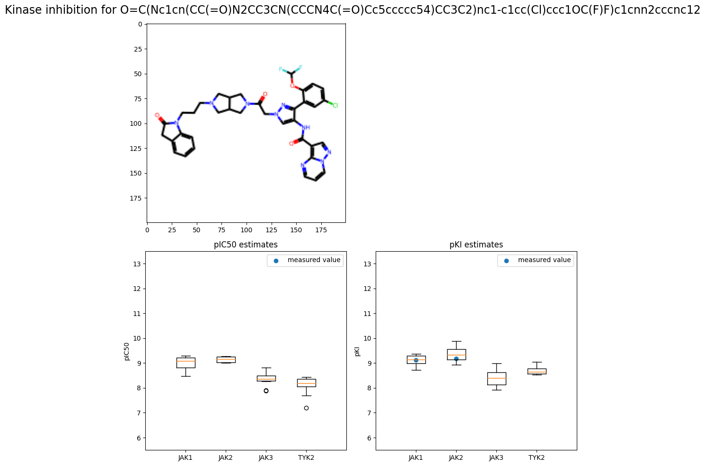

# Estimating inhibition metrics for JAK kinases

Feature embedding from small molecule [SMILES](https://en.wikipedia.org/wiki/Simplified_molecular-input_line-entry_system) sequences with a from-scratch (starting with PyTorch) transformer model.

The embeddings are used to predict the small molecule inhibition of [Janus (JAK) family kinases](https://en.wikipedia.org/wiki/Janus_kinase) kinases with bootstrap uncertainty from an ensemble of dense neural networks. 

The figure below gives and example of the predicted pKi of the JAK family kinase when treated with a small molecule. As you can see, the measured values (blue markers) fall within the predicted range of predictions for JAK1 and JAK2 in this example. 

## Summary

The objective of this project is to predict pKi (log dissocation constant [Ki](https://en.wikipedia.org/wiki/Enzyme_inhibitor#Quantitative_description) of small molecules on Janus-associated kinases JAK1, JAK2, JAK3, and TYK2). 

It's typically the case in drug development and design that off-target effects are not wanted, but it is often tedious to measure the effect of what may be a large library of candidate small molecules to rule out activity on non-target proteins. We would like to instead be able to predict which candidate molecules have a big gap in target inhibition relative to off-target inhibition and other side effects. 

I used a two part approach: unsupervised training with a transformer on SMILES sequences, then training a bootstrap ensemble of multilayer perceptrons on the encoded features extracted by the pre-trained transformer. My notes on each part of the process can be found in the notebooks linked below. If you'd like to try out a deployment prototype first, check out the [notebook mockup](https://mybinder.org/v2/gh/riveSunder/JAKInhibition/HEAD?labpath=notebooks%2Fmockup.ipynb)

0. [Index](notebooks/index.ipynb)
1. [Exploratory Data Analysis](notebooks/eda.ipynb)
2. [Data Processing](notebook/data_processing.ipynb)
3. [Model Development](notebooks/model_development.ipynb)
4. [Model Evaluation](notebooks/model_evaluation.ipynb)
5. [Model Deployment](notebooks/model_deployment.ipynb) -> prototype on [mybinder](https://mybinder.org/v2/gh/riveSunder/JAKInhibition/HEAD?labpath=notebooks%2Fmockup.ipynb) or [local notebook](notebooks/mock.ipynb)
6. [Future Ideas](notebooks/future_ideas.ipynb)

